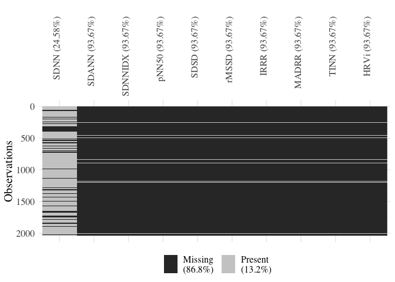
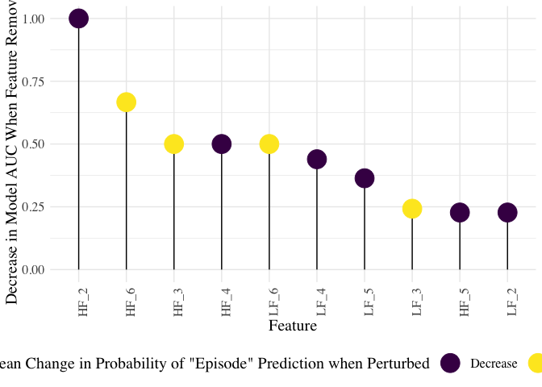
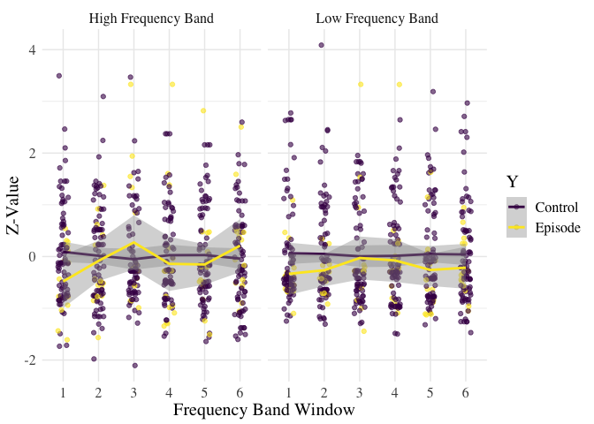

Methods & Results Section
================

  - [Statistical Analyses](#statistical-analyses)
  - [Results](#results)
      - [The Dataset.](#the-dataset.)
      - [Machine Learning Analyses.](#machine-learning-analyses.)

``` r
suppressPackageStartupMessages(
  {
    library(tidyverse, quietly = TRUE)
    library(knitr, quietly = TRUE)
    library(DAAG, quietly = TRUE)
    library(here, quietly = TRUE)
    library(naniar, quietly = TRUE)
    library(kableExtra, quietly = TRUE)
    library(ggsignif, quietly = TRUE)
    library(viridis, quietly = TRUE)
    library(forcats, quietly = TRUE)
    library(caret, quietly = TRUE)
    library(ROSE, quietly = TRUE)
    library(e1071, quietly = TRUE)
    library(ModelMetrics, quietly = TRUE)
    library(scales, quietly = TRUE)
    library(ggcorrplot, quietly = TRUE)
  }
)
```

    ## Warning: package 'ggplot2' was built under R version 3.5.2

    ## Warning: package 'tibble' was built under R version 3.5.2

    ## Warning: package 'tidyr' was built under R version 3.5.2

    ## Warning: package 'purrr' was built under R version 3.5.2

    ## Warning: package 'dplyr' was built under R version 3.5.2

    ## Warning: package 'stringr' was built under R version 3.5.2

    ## Warning: package 'knitr' was built under R version 3.5.2

    ## Warning: package 'ggsignif' was built under R version 3.5.2

``` r
### This function is used to format a p value and return an APA valid string with threshold of 0.05  
p_format <- function(vec, thresh = 0.05, star1 = 0.05, star2 = 0.01, star3 = 0.001){
  
  vec2 = NULL
  vec2 <- sapply(vec, formatC)
  
  for(x in 1:length(vec)){
    if(vec[x] <= star3){
      vec2[x] = "< 0.001 ***"
    }
    else if(vec[x] <= star2){
      vec2[x] = "< 0.01 **"
    }
    else if(vec[x] <= star1){
      vec2[x] = "< 0.05 *"
    }
  }
  vec2
}

### This function is used to plot the results of the permutation-t tests
### It uses the ggsignif package to add bridges between groups and p values
permutation_plot <- function(df, height = 1.2, tip = 0.1){
    
  n <- df %>%
    rowid_to_column() %>%
    group_by(variable) %>%
    arrange(-Mean) %>%
    slice(1) %>%
    pull(rowid)
  y_position <- df$Mean[n] * height
  
  plt  <- df %>% 
    mutate(Feature = variable) %>%
    {
      ggplot(., aes(x = Feature, y = Mean, fill = Group)) +
        geom_col(position = "dodge") +
        theme_minimal() +
        theme(axis.text.x = element_text(angle = 90, hjust = 1), text = element_text(size=17, family = "Times")) + 
        geom_signif(family = "Times", annotations = sapply(.$p.val[n], p_format),
                    xmin = seq(0.8, length.out = length(n)),
                    xmax = seq(1.2, length.out = length(n)),
                    y_position = y_position,
                    tip_length=tip
                    ) +
        scale_fill_viridis_d(labels = c("Control", "Episode"))
  }
  plt
}

set.seed(1342)
```

``` r
# all initial surveys
all_surveys <- read_csv(here('data','Preprocessing_data_outputs', 'UpdatedSurveys_180713.csv')) %>%
  filter(complete.cases(.)) %>%
  mutate(Y = ifelse(EmotionalEatingEpisodes == 2, 'Control', 'Episode'))

# data used for frequency domain analysis
df_freq <- read_csv(here('data', 'Preprocessing_data_outputs', 'Paper', 'data_out_20181113.csv'))

# data used for time domain analysis
df_time <- read_csv(here('data', 'Preprocessing_data_outputs', 'Paper', 'data_out.csv'))
```

## Statistical Analyses

Data analyses were carried out in R version 3.5.0 (2018-04-23) and
Python 2.7. In accordance with previous studies examining the relation
between HRV and discrete eating episodes (Friesen et al. 2007; Harthoorn
and Dransfield 2007; Ranzenhofer et al. 2016), physiological data
collected in the 30-minute period preceding the eating episode were
examined. For each participant, the inter-beat interval (IBI) for each
self-reported survey was selected, where surveys were either
self-reported at the time of an eating episode, or pseudo-randomly
triggered in the app. This resulted in an initial total of \(n=\) 487
emotional eating episodes and \(n=\) 3155 control episodes before
cleaning the data.

Using the RHRV package (Rodriguez-Linares et al. 2017), IBI data streams
were filtered, interpolated, and artifacts were removed, using
thresholds and parameters in compliance with normative reported values
for heart rate variability features (Shaffer and Ginsberg 2017).
Observations that did not meet normative criteria were removed.
Consistent with existing research, features of heart rate variability
were extracted from both the time and frequency domain to measure both
the amount of variability and the amount of signal energy in the
30-minute period (Shaffer and Ginsberg 2017; Rubin et al. 2016).

The following heart rate variability features were extracted from the
IBI streams for each observation in the time domain: *SDNN* (Standard
Deviation of all filtered inter-beat intervals); *SDANN* (Standard
Deviation of inter-beat intervals between all successive heartbeats);
*SDNNIX* (Mean of the standard deviations of all the filtered inter-beat
intervals for each 5 min segment of the IBI stream); *pNN50* (Percentage
of successive inter-beat intervals that differ by more than 50 ms);
*SDSD* (Standard Deviation of Successive Differences of inter-beat
intervals); *rMSSD* (Root Mean Square of Successive Differences); *IRRR*
(length of the interval determined by the first and the third quantile
of the inter-beat interval); *MADRR* (Median of the Absolute values of
the successive Differences between the inter-beat intervals); *TINN*
(Triangular Interpolation of inter-beat interval histogram); and *HRVi*
(Heart Rate Variability index) (Rodriguez-Linares et al. 2017). *SDNN*
reflects the power of the components responsible for variability in
heart rhythm, while *SDANN*, *SDNNIX*, *pNN50*, *SDSD*, *rMSSD*, *IRRR*,
and *MADRR* reflect different statistical aspects of the high frequency
variation in heart rhythm. Finally, *TINN* and *HRVi* represent
geometric measures calculated from the density distribution of
inter-beat intervals (Rodriguez-Linares et al. 2017).

In the frequency domain, features extracted included the mean
non-interpolated heart rate (*mean niHR*), the mean interpolated Heart
Rate (*mean HR*), and the heart rate values at the start and end of the
30 minute window (*Start HR*, *End HR*). Additional frequency domain
features were extracted from the 30 minute streams by applying a Fourier
transform to the heart rate signal, resulting in a spectrogram of the
heart rate in the low and high frequency ranges. To extract a sufficient
amount of information from these spectograms and increase the variance
of our data, the spectrogram was split into 5 minute windows, as has
been done previously in studies using heart rate variability to predict
event-level behavior (Rubin et al. 2016). Mean features were extracted
from each of these windows — the mean Low Frequency signal (\(LF_1\),
\(LF_2\),… \(LF_6\)), the mean High Frequency signal (\(HF_1\),
\(HF_2\),… \(HF_6\)), and the mean Low Frequency-High Frequency Ratio
(\(LFHF_1\), \(LFHF_2\),… \(LFHF_6\)).

Using machine learning, we attempted to classify eating episodes and
controls using these two sets of features separately. Using the CARET
package (Jed Wing et al. 2018), a Support Vector Machine (SVM) with a
polynomial kernel was implemented to predict episodes apart from
controls. All features were standardized within-subject, and in order to
address the group imbalance in this stage, controls were randomly
downsampled and episodes were randomly upsampled using the ROSE package
(Lunardon, Menardi, and Torelli 2014). To evaluate model performance,
models were tested using 4-fold cross validation, training models on 3/4
of training data and using the remaining 1/4 of testing data to evaluate
model accuracy, specificity, and sensitivity. Additionally, we emply two
strategies to assess variable importance. The first is to iteratively
remove each feature, and then fit and evaluate the SVM to this reduced
dataset; we then compare how removing each variable from the model
affects the achieved Area Under the Curve (AUC) in the procedure. The
second is to iteratively perturb each feature by one standard unit, and
then fit and evaluate the SVM in a similar manner, this time comparing
how perturbing the data in each feature influences the predicted
probabilities of data belonging to the “episode” class.

# Results

## The Dataset.

``` r
df_time_nrow <- df_time %>% 
  # use params threshold = 250, windows = 2
  filter(threshold == 250 & winds == 2) %>%
  # remove high stress controls
  filter(!(Stress >= 5 & Y == "Control")) %>%
  select(-c(winds, threshold, index, when, Event, Stress, ID), Y, SDNN:HRVi) %>%
  group_by(Y) %>%
  count()

df_freq_nrow <- df_freq %>%
  # use params threshold = 100, windows = 2
  filter(threshold == 100 & winds == 2) %>%
  # remove high stress controls
  filter(!(Stress >= 5 & Y == "Control")) %>%
  select(-c(winds, threshold, index, when, Event, Stress, ID), Y, SDNN:HRVi) %>%
  group_by(Y) %>%
  count()
```

(ref:missingness-time) Completeness of Features in the Time Domain

(ref:missingness-freq) Completeness of Features in the Frequency Domain

(ref:missingness-tab) Number of Observations Extracted for Each Feature

After cleaning the dataset of erroneous surveys (e.g. no usable IBI
data; overlapping survey responses; control observations with high
self-reported stress), and filtering IBI streams that did not meet
filtering quality criteria for preprocessing, the data consisted of
\(n=\) 285 emotional eating episodes and \(n=\) 1753 controls. Of these
clean observations, HRV features were extracted from the IBI streams,
although even with filtering, many IBI streams were too sparse to
compute HRV features. Figures @ref(fig:missingness-time) and
@ref(fig:missingness-freq) illustrate the completeness of data in the
extracted time and frequency domain features, with table
@ref(tab:missingness-tab) showing the final number of observations used
for analysis. Much of the data missing from the time domain is due to
the fact that these features are derived from SDNN and are dependent on
having sufficient data in this feature.

``` r
df_time %>% 
  # use params threshold = 250, windows = 2
  filter(threshold == 250 & winds == 2) %>%
  # remove high stress controls
  filter(!(Stress >= 5 & Y == "Control")) %>%
  select(-c(winds, threshold, index, when, Event, Stress, ID, Y), SDNN:HRVi) %>%
  vis_miss(.) +
  theme(
    axis.text.x = element_text(angle = 90, hjust = 1),
    text = element_text(size=15, family = "Times")
    )
```



``` r
df_freq %>% 
  # use params threshold = 100, windows = 2
  filter(threshold == 100 & winds == 2) %>%
  # remove high stress controls
  filter(!(Stress >= 5 & Y == "Control")) %>%
  select(-c(winds, threshold, index, when, Event, Stress, ID, Y)) %>%
  select(Avg_niHR:LFHF_6) %>%
  vis_miss(.) +
  theme(
    axis.text.x = element_text(angle = 90, hjust = 1),
    text = element_text(size=15, family = "Times")
    )
```


``` r
### Run Permutation T-tests

df_time_summaries <- df_time %>% 
  # use params threshold = 250, windows = 2
  filter(threshold == 250 & winds == 2) %>%
  # remove high stress controls
  filter(!(Stress >= 5 & Y == "Control")) %>%
  # select time domain
  select(-c(winds, threshold, index, when, Event, Stress, ID), Y, SDNN:HRVi) %>%
  # use summarise_at to create within variable summaries
  summarise_at(
    .funs = funs(
      
      # for each variable, count non-NA
      n = length(.[complete.cases(.)]),
      n.control = length(.[complete.cases(.) & Y == "Control"]),
      n.episode = length(.[complete.cases(.) & Y != "Control"]),
      
      # for each variable, calculate the mean, removing NA in each
      mean = mean(., na.rm = TRUE),
      mean.control = mean(.[Y == "Control"], na.rm = TRUE),
      mean.episode = mean(.[Y != "Control"], na.rm = TRUE),
      
      # for each variable, calculate the sd, removing NA in each
      sd = sd(., na.rm = TRUE),
      sd.control = sd(.[Y == "Control"], na.rm = TRUE),
      sd.episode = sd(.[Y != "Control"], na.rm = TRUE),
      
      # for each variable, run TwoT perm between control and episode, removing NA in each
      p.val = twotPermutation(.[Y == "Control" & !is.na(.)],
                              .[Y != "Control" & !is.na(.)],
                              nsim = 10000, plotit = F)
      ),
    .vars = vars(SDNN:HRVi)
    ) %>% 
  gather(key, value) %>%
  separate(key, c("variable", "statistic"), sep = "_")

df_freq_summaries <- df_freq %>% 
  # use params threshold = 250, windows = 2
  filter(threshold == 100 & winds == 2) %>%
  # remove high stress controls
  filter(!(Stress >= 5 & Y == "Control")) %>%
  # select frequency domain
  select(-c(winds, threshold, index, when, Event, Stress, ID)) %>%
  select(Y, Avg_niHR:LFHF_6) %>%
  
  # truncate frequency power bands
  mutate_at(., .funs = funs(ifelse(. > 3630, 3630, 
                                   ifelse(. < 80, 80, .))),
            .vars = vars(matches("^HF_.*")))%>%
  mutate_at(., .funs = funs(ifelse(. > 1010, 101,
                                   ifelse(. < 190, 190, .))), 
            .vars = vars(matches("^LF_.*")))%>%
  mutate_at(., .funs = funs(ifelse(. > 12, 12,
                                   ifelse(. < 1, 1, .))), 
            .vars = vars(matches("LFHF_.*"))) %>%
  
  # use summarise_at to create within variable summaries
  summarise_at(
    .funs = funs(
      
      # for each variable, count non-NA
      n = length(.[complete.cases(.)]),
      n.control = length(.[complete.cases(.) & Y == "Control"]),
      n.episode = length(.[complete.cases(.) & Y != "Control"]),
      
      # for each variable, calculate the mean, removing NA in each
      mean = mean(., na.rm = TRUE),
      mean.control = mean(.[Y == "Control"], na.rm = TRUE),
      mean.episode = mean(.[Y != "Control"], na.rm = TRUE),
      
      # for each variable, calculate the sd, removing NA in each
      sd = sd(., na.rm = TRUE),
      sd.control = sd(.[Y == "Control"], na.rm = TRUE),
      sd.episode = sd(.[Y != "Control"], na.rm = TRUE),
      
      # for each variable, run TwoT perm between control and episode, removing NA in each
      p.val = twotPermutation(.[Y == "Control" & !is.na(.)],
                              .[Y != "Control" & !is.na(.)],
                              nsim = 10000, plotit = F)
      ),
    .vars = vars(Avg_niHR:LFHF_6)
    ) %>% 
  gather(key, value) %>%
  separate(key, c("variable", "statistic"), sep = "_(?!.*_)")
```

(ref:timeSummary) Summary of Features in the Time Domain

(ref:freqSummary) Summary of Features in the Frequency Domain

The mean values for each time-domain feature are shown in Table
@ref(tab:timeSummary), while the mean values for each frequency feature
are shown in Table @ref(tab:freqSummary).

``` r
### Tabulate the time domain means
df_time_summaries %>%
  filter(statistic != "p.val") %>%
  filter(!str_detect(statistic, "control|episode")) %>%
  spread(key = statistic, value = value) %>%
  select(variable, n, mean, sd) %>% 
  kable(digits=2, caption = '(ref:timeSummary)') %>%
  kable_styling()
```

<table class="table" style="margin-left: auto; margin-right: auto;">

<caption>

(ref:timeSummary)

</caption>

<thead>

<tr>

<th style="text-align:left;">

variable

</th>

<th style="text-align:right;">

n

</th>

<th style="text-align:right;">

mean

</th>

<th style="text-align:right;">

sd

</th>

</tr>

</thead>

<tbody>

<tr>

<td style="text-align:left;">

HRVi

</td>

<td style="text-align:right;">

129

</td>

<td style="text-align:right;">

7.17

</td>

<td style="text-align:right;">

1.99

</td>

</tr>

<tr>

<td style="text-align:left;">

IRRR

</td>

<td style="text-align:right;">

129

</td>

<td style="text-align:right;">

65.29

</td>

<td style="text-align:right;">

28.54

</td>

</tr>

<tr>

<td style="text-align:left;">

MADRR

</td>

<td style="text-align:right;">

129

</td>

<td style="text-align:right;">

26.04

</td>

<td style="text-align:right;">

10.93

</td>

</tr>

<tr>

<td style="text-align:left;">

pNN50

</td>

<td style="text-align:right;">

129

</td>

<td style="text-align:right;">

19.83

</td>

<td style="text-align:right;">

10.59

</td>

</tr>

<tr>

<td style="text-align:left;">

rMSSD

</td>

<td style="text-align:right;">

129

</td>

<td style="text-align:right;">

48.54

</td>

<td style="text-align:right;">

13.14

</td>

</tr>

<tr>

<td style="text-align:left;">

SDANN

</td>

<td style="text-align:right;">

129

</td>

<td style="text-align:right;">

15.44

</td>

<td style="text-align:right;">

15.45

</td>

</tr>

<tr>

<td style="text-align:left;">

SDNN

</td>

<td style="text-align:right;">

1537

</td>

<td style="text-align:right;">

69.43

</td>

<td style="text-align:right;">

24.84

</td>

</tr>

<tr>

<td style="text-align:left;">

SDNNIDX

</td>

<td style="text-align:right;">

129

</td>

<td style="text-align:right;">

43.87

</td>

<td style="text-align:right;">

12.78

</td>

</tr>

<tr>

<td style="text-align:left;">

SDSD

</td>

<td style="text-align:right;">

129

</td>

<td style="text-align:right;">

48.56

</td>

<td style="text-align:right;">

13.14

</td>

</tr>

<tr>

<td style="text-align:left;">

TINN

</td>

<td style="text-align:right;">

129

</td>

<td style="text-align:right;">

112.05

</td>

<td style="text-align:right;">

31.13

</td>

</tr>

</tbody>

</table>

``` r
### tabulate the frequency domain means
order = c("Avg_HR", "Avg_niHR", "Start_niHR", "End_niHR",
          paste0("HF_", 1:6),
          paste0("LF_", 1:6))
df_freq_summaries %>%
  filter(statistic != "p.val") %>%
  filter(!str_detect(statistic, "control|episode")) %>%
  spread(key = statistic, value = value) %>%
  select(variable, n, mean, sd) %>%
  slice(match(order, variable)) %>%
  kable(digits=2, caption = '(ref:freqSummary)') %>%
  kable_styling() %>%
  kableExtra::group_rows("Heart Rate", 1, 4) %>%
  kableExtra::group_rows("High Frequency", 5, 10) %>%
  kableExtra::group_rows("Low Frequency", 11, 16)
```

<table class="table" style="margin-left: auto; margin-right: auto;">

<caption>

(ref:freqSummary)

</caption>

<thead>

<tr>

<th style="text-align:left;">

variable

</th>

<th style="text-align:right;">

n

</th>

<th style="text-align:right;">

mean

</th>

<th style="text-align:right;">

sd

</th>

</tr>

</thead>

<tbody>

<tr grouplength="4">

<td colspan="4" style="border-bottom: 1px solid;">

<strong>Heart Rate</strong>

</td>

</tr>

<tr>

<td style="text-align:left; padding-left: 2em;" indentlevel="1">

Avg\_HR

</td>

<td style="text-align:right;">

1497

</td>

<td style="text-align:right;">

79.50

</td>

<td style="text-align:right;">

12.13

</td>

</tr>

<tr>

<td style="text-align:left; padding-left: 2em;" indentlevel="1">

Avg\_niHR

</td>

<td style="text-align:right;">

1497

</td>

<td style="text-align:right;">

80.26

</td>

<td style="text-align:right;">

12.20

</td>

</tr>

<tr>

<td style="text-align:left; padding-left: 2em;" indentlevel="1">

Start\_niHR

</td>

<td style="text-align:right;">

1497

</td>

<td style="text-align:right;">

83.58

</td>

<td style="text-align:right;">

17.76

</td>

</tr>

<tr>

<td style="text-align:left; padding-left: 2em;" indentlevel="1">

End\_niHR

</td>

<td style="text-align:right;">

1497

</td>

<td style="text-align:right;">

81.34

</td>

<td style="text-align:right;">

15.69

</td>

</tr>

<tr grouplength="6">

<td colspan="4" style="border-bottom: 1px solid;">

<strong>High Frequency</strong>

</td>

</tr>

<tr>

<td style="text-align:left; padding-left: 2em;" indentlevel="1">

HF\_1

</td>

<td style="text-align:right;">

515

</td>

<td style="text-align:right;">

282.34

</td>

<td style="text-align:right;">

382.80

</td>

</tr>

<tr>

<td style="text-align:left; padding-left: 2em;" indentlevel="1">

HF\_2

</td>

<td style="text-align:right;">

528

</td>

<td style="text-align:right;">

271.35

</td>

<td style="text-align:right;">

351.14

</td>

</tr>

<tr>

<td style="text-align:left; padding-left: 2em;" indentlevel="1">

HF\_3

</td>

<td style="text-align:right;">

535

</td>

<td style="text-align:right;">

262.68

</td>

<td style="text-align:right;">

291.35

</td>

</tr>

<tr>

<td style="text-align:left; padding-left: 2em;" indentlevel="1">

HF\_4

</td>

<td style="text-align:right;">

522

</td>

<td style="text-align:right;">

248.05

</td>

<td style="text-align:right;">

289.56

</td>

</tr>

<tr>

<td style="text-align:left; padding-left: 2em;" indentlevel="1">

HF\_5

</td>

<td style="text-align:right;">

511

</td>

<td style="text-align:right;">

254.59

</td>

<td style="text-align:right;">

317.44

</td>

</tr>

<tr>

<td style="text-align:left; padding-left: 2em;" indentlevel="1">

HF\_6

</td>

<td style="text-align:right;">

515

</td>

<td style="text-align:right;">

295.68

</td>

<td style="text-align:right;">

432.77

</td>

</tr>

<tr grouplength="6">

<td colspan="4" style="border-bottom: 1px solid;">

<strong>Low Frequency</strong>

</td>

</tr>

<tr>

<td style="text-align:left; padding-left: 2em;" indentlevel="1">

LF\_1

</td>

<td style="text-align:right;">

515

</td>

<td style="text-align:right;">

320.98

</td>

<td style="text-align:right;">

254.62

</td>

</tr>

<tr>

<td style="text-align:left; padding-left: 2em;" indentlevel="1">

LF\_2

</td>

<td style="text-align:right;">

528

</td>

<td style="text-align:right;">

319.81

</td>

<td style="text-align:right;">

246.48

</td>

</tr>

<tr>

<td style="text-align:left; padding-left: 2em;" indentlevel="1">

LF\_3

</td>

<td style="text-align:right;">

535

</td>

<td style="text-align:right;">

323.36

</td>

<td style="text-align:right;">

247.22

</td>

</tr>

<tr>

<td style="text-align:left; padding-left: 2em;" indentlevel="1">

LF\_4

</td>

<td style="text-align:right;">

522

</td>

<td style="text-align:right;">

314.75

</td>

<td style="text-align:right;">

238.92

</td>

</tr>

<tr>

<td style="text-align:left; padding-left: 2em;" indentlevel="1">

LF\_5

</td>

<td style="text-align:right;">

511

</td>

<td style="text-align:right;">

334.37

</td>

<td style="text-align:right;">

253.86

</td>

</tr>

<tr>

<td style="text-align:left; padding-left: 2em;" indentlevel="1">

LF\_6

</td>

<td style="text-align:right;">

515

</td>

<td style="text-align:right;">

345.29

</td>

<td style="text-align:right;">

269.47

</td>

</tr>

</tbody>

</table>

## Machine Learning Analyses.

``` r
### Define Functions for ML

### Main SVM model fitting function
modelfit <- function(data){
  
  train <- data$train
  test <- data$test
  # fit the model on the training set
  fit <- train(Y ~ ., data = train, method="svmPoly")
  
  # predict on the test set
  yhat = predict(fit, newdata = select(test, -Y))
  
  # evaluate test set accuracy
  conf <- caret::confusionMatrix(yhat, test$Y)
  result <- c(conf$overall[1], conf$byClass[1:2]) #<-can change threshold if you want
  result["auc"] <- auc(test$Y, yhat)
  
  return(result)
  
}

### Fit an SVM and perturb one column at a time
perturb_model_fit <- function(data){
  
  train <- data$train
  test <- data$test
  
  # fit the model on the training set
  invisible(capture.output(fit <- train(Y ~ ., data = train, method="svmPoly", trControl = trainControl(classProbs = TRUE))))
  # get these fitted probabilities
  y = predict(fit, newdata = select(test, -Y), type = "prob") %>%
    rownames_to_column()
  
  # perturb a column from the training set and get the new probabilities
  result <- list(Control = y)
  
  for(c in 2:ncol(test)){
    
    col <- names(train)[c]
    temp <- test
    temp[, col] <- temp[, col] + 1
    result[[col]] <- predict(fit, newdata = select(temp, -Y), type = "prob") %>%
      rownames_to_column()
    
  }
  
  # tidy the results before returning
  bound <- bind_rows(result, .id='Perturbed_Feature') %>%
    mutate(rowname = as.numeric(rowname)) %>%
    select(-Control) %>% 
    spread(key = "Perturbed_Feature", value = Episode) %>%
    as_tibble() %>%
    bind_cols(Y = test$Y)
  
  return(bound)
  
}

### Split a dataset into a train and test set
train_test <- function(dataset, folder, print = FALSE){
  
  # issue here with namespace and "data" variable reference
  data <- dataset[-folder, ]
  mytest <- dataset[folder, ]
  
  # generate a balanced training set
  train <- ovun.sample(
    Y ~ .,
    data=data,
    method = "both",
    p = 0.6,
    seed = 1342
  )$data
  
  train <- as_tibble(train) %>%
    droplevels()
  test <- as_tibble(mytest) %>%
    droplevels()
  
  if(print){
    print("Training set:")
    print(train)
    print(table(train$Y))
    print("Testing set:")
    print(test)
    print(table(test$Y))
  }
  
  return(list(train = train, test = test))
  
}

### Get variable importance by looping over the columns, leave-one-out for each model; uses main model fitting function
leave_one_out_auc <- function(df, col){
  
  df_reduced <- df %>%
    select(-!!col)      # remove this column
  set.seed(9)
  nfolds <- 4
  subdata <- createFolds(df_reduced$Y, nfolds)
  
  temp1 <- train_test(df_reduced, subdata$Fold1) %>%
    modelfit()
  temp2 <- train_test(df_reduced, subdata$Fold2) %>%
    modelfit()
  temp3 <- train_test(df_reduced, subdata$Fold3) %>%
    modelfit()
  temp4 <- train_test(df_reduced, subdata$Fold4)%>%
    modelfit()

    
  auc <- colMeans(rbind(temp1['auc'],temp2['auc'], temp3['auc'], temp4['auc'])) %>%
    t() %>%
    data.frame(auc = ., variable = names(df)[col])
  return(auc)
}
```

``` r
# prep datasets

df_time_ml <- read.csv(here('data', 'Preprocessing_data_outputs', 'Paper', 'data_out.csv'))%>%
  # use params threshold = 250, windows = 2
  filter(threshold == 250 & winds == 2)%>%
  select(-winds, - threshold, -index) %>%
  filter(complete.cases(.)) %>%
  filter(!((Stress>=5) & (Y == "Control")))

df_time_ml <- df_time_ml %>%
  mutate(ID = as.factor(ID)) %>%
  group_by(ID) %>%
  mutate_at(vars(SDNN:HRVi), scale) %>%
  ungroup() %>%
  select(Y:HRVi) %>%
  filter(complete.cases(.))

df_freq_ml <- read.csv(here('data', 'Preprocessing_data_outputs', 'Paper', 'data_out_20181113.csv'))%>%
  # use params threshold = 250, windows = 2
  select(-c(winds, threshold, index, when, Event)) %>%
  select(Y, ID, Stress, Avg_niHR:LF_6) %>%
  filter(complete.cases(.)) %>%
  filter(!(Stress >= 5 & Y == "Control"))
  

df_freq_ml <- df_freq_ml %>%
  mutate(ID = as.factor(ID)) %>%
  group_by(ID) %>%
  mutate_at(vars(Avg_niHR:LF_6), scale) %>%
  ungroup() %>%
  select(Y, Avg_niHR:LF_6) %>%
  filter(complete.cases(.))
```

``` r
### Run time domain ML
set.seed(9)
nfolds <- 4
subdata<-createFolds(df_time_ml$Y, nfolds)
t1_z <- train_test(df_time_ml, subdata$Fold1) %>%
  modelfit()
t2_z <- train_test(df_time_ml, subdata$Fold2) %>%
  modelfit()
t3_z <- train_test(df_time_ml, subdata$Fold3) %>%
  modelfit()
t4_z <- train_test(df_time_ml, subdata$Fold4) %>%
  modelfit()
results_time <- colMeans(rbind(t1_z, t2_z, t3_z, t4_z))
```

``` r
### Compute time domain AUC comparison

auc_comparison_time <- list()

for(c in 2:ncol(df_time_ml)){
  auc_comparison_time <- leave_one_out_auc(df_time_ml, c) %>%
    rbind(auc_comparison_time)
}

auc_time <- auc_comparison_time %>%
  mutate(Reduction_AUC = results_time['auc'] - auc) %>%
  mutate(Reduction_AUC = rescale(Reduction_AUC, c(0,1))) %>%
  arrange(-Reduction_AUC)
```

``` r
### Compute time domain perturbation comparison
 
set.seed(9)
nfolds <- 4
subdata<-createFolds(df_time_ml$Y, nfolds)

perturbed_time_1 <- train_test(df_time_ml, subdata$Fold1) %>%     # split train and test
  perturb_model_fit() %>%                                   # fit model and perturb each column
  mutate_at(                                                # tidy to get differences
    .vars = vars(-rowname, -Y, -Control),
    .funs = list(Delta = ~. - Control))# %>%
  #select(Y, contains("Delta"))

perturbed_time_2 <- train_test(df_time_ml, subdata$Fold2) %>%     # split train and test
  perturb_model_fit() %>%                                   # fit model and perturb each column
  mutate_at(                                                # tidy to get differences
    .vars = vars(-rowname, -Y, -Control),
    .funs = list(Delta = ~. - Control)) #%>%
  #select(Y, contains("Delta"))

perturbed_time_3 <- train_test(df_time_ml, subdata$Fold3) %>%     # split train and test
  perturb_model_fit() %>%                                   # fit model and perturb each column
  mutate_at(                                                # tidy to get differences
    .vars = vars(-rowname, -Y, -Control),
    .funs = list(Delta = ~. - Control)) #%>%
  #select(Y, contains("Delta"))

perturbed_time_4 <- train_test(df_time_ml, subdata$Fold4) %>%     # split train and test
  perturb_model_fit() %>%                                   # fit model and perturb each column
  mutate_at(                                                # tidy to get differences
    .vars = vars(-rowname, -Y, -Control),
    .funs = list(Delta = ~. - Control)) #%>%
  #select(Y, contains("Delta"))
```

``` r
### ML frequency domain

set.seed(9)
nfolds <- 4
subdata<-createFolds(df_freq_ml$Y, nfolds)
f1_z <- train_test(df_freq_ml, subdata$Fold1) %>%
  modelfit()
f2_z <- train_test(df_freq_ml, subdata$Fold2) %>%
  modelfit()
f3_z <- train_test(df_freq_ml, subdata$Fold3) %>%
  modelfit()
f4_z <- train_test(df_freq_ml, subdata$Fold4) %>%
  modelfit()
results_freq <- colMeans(rbind(f1_z, f2_z, f3_z, f4_z))
```

``` r
### frequency domain AUC comparison

auc_comparison_freq <- list()

for(c in 2:ncol(df_freq_ml)){
  auc_comparison_freq <- leave_one_out_auc(df_freq_ml, c) %>%
    rbind(auc_comparison_freq)
}

auc_freq <- auc_comparison_freq %>%
  mutate(Reduction_AUC = results_freq['auc'] - auc) %>%
  mutate(Reduction_AUC = rescale(Reduction_AUC, c(0,1))) %>%
  arrange(-Reduction_AUC)
```

``` r
### frequency domain perturbation comparison
 
set.seed(9)
nfolds <- 4
subdata<-createFolds(df_freq_ml$Y, nfolds)

perturbed_freq_1 <- train_test(df_freq_ml, subdata$Fold1) %>%     # split train and test
  perturb_model_fit() %>%                                   # fit model and perturb each column
  mutate_at(                                                # tidy to get differences
    .vars = vars(-rowname, -Y, -Control),
    .funs = list(Delta = ~. - Control)) #%>%
  #select(Y, contains("Delta"))

perturbed_freq_2 <- train_test(df_freq_ml, subdata$Fold2) %>%     # split train and test
  perturb_model_fit() %>%                                   # fit model and perturb each column
  mutate_at(                                                # tidy to get differences
    .vars = vars(-rowname, -Y, -Control),
    .funs = list(Delta = ~. - Control)) #%>%
  #select(Y, contains("Delta"))

perturbed_freq_3 <- train_test(df_freq_ml, subdata$Fold3) %>%     # split train and test
  perturb_model_fit() %>%                                   # fit model and perturb each column
  mutate_at(                                                # tidy to get differences
    .vars = vars(-rowname, -Y, -Control),
    .funs = list(Delta = ~. - Control)) #%>%
  #select(Y, contains("Delta"))

perturbed_freq_4 <- train_test(df_freq_ml, subdata$Fold4) %>%     # split train and test
  perturb_model_fit() %>%                                   # fit model and perturb each column
  mutate_at(                                                # tidy to get differences
    .vars = vars(-rowname, -Y, -Control),
    .funs = list(Delta = ~. - Control)) #%>%
  #select(Y, contains("Delta"))
```

``` r
## data munging to collate the results
time_domain_deltas <- bind_rows(perturbed_time_1, perturbed_time_2, perturbed_time_3, perturbed_time_4) %>%
  summarise_if(is.numeric, mean) %>%
  select(-rowname) %>%
  t() %>% 
  as.data.frame() %>%
  rownames_to_column("variable") %>%
  filter(str_detect(variable, "Delta")) %>%
  transmute(variable = str_remove(variable, "_Delta"), Delta_Probability = V1)

freq_domain_deltas <- bind_rows(perturbed_freq_1, perturbed_freq_2, perturbed_freq_3, perturbed_freq_4) %>%
  summarise_if(is.numeric, mean) %>%
  select(-rowname) %>%
  t() %>%
  as.data.frame() %>%
  rownames_to_column("variable") %>%
  filter(str_detect(variable, "Delta")) %>%
  transmute(variable = str_remove(variable, "_Delta"), Delta_Probability = V1)
```

(ref:ml-metrics) Machine Learning Evaluation Metrics

Machine learning models were implemented using time domain and frequency
domain features separately. In order to run machine learning prediction
of emotional eating episodes, only observations with complete data for
all features in the time or frequency domain were used, data within each
participant were scaled and centered, and observations were randomly
upsampled (from episodes) or downsampled (from controls) to balance the
number of observations and controls. SVM models were fit iteratively
using 3/4’s of the data, and their performance was evaluated on the
remaining 1/4. Figure @ref(fig:ml-metrics) shows the mean accuracy,
sensitivity, and specificity of the SVM across these four folds.

``` r
### plotting the ml results
ml_time <- results_time %>%
  enframe(name = "Metric", value = "Value") %>%
  mutate(Metric = ifelse(Metric == "auc", "AUC", Metric),
         Domain = "Time")

ml_freq <- results_freq %>%
  enframe(name = "Metric", value = "Value") %>%
  mutate(Metric = ifelse(Metric == "auc", "AUC", Metric),
         Domain = "Frequency")

bind_rows(ml_time, ml_freq) %>%
  ggplot(aes(x=Metric, y=Value, fill=Domain))+
  geom_col(position = "dodge") +
  geom_text(aes(label=formatC(Value, 2), y = Value + 0.025), position = position_dodge(width=0.9), vjust=-0.25, family = "Times") +
  theme_minimal() +
  scale_fill_viridis_d() +
  theme(text = element_text(size=15, family = "Times"))
```


Overall, the frequency domain features achieve the highest
classification accuracy (77.99%), sensitivity (78.75%), and specificity
(75%).

(ref:varImportance-time) Pseudo-Feature Importance by Removing &
Perturbing Each Feature: Time Domain

(ref:varImportance-freq) Pseudo-Feature Importance by Removing &
Perturbing Each Feature: Frequency Domain

To interpret the feature importance in each of these models, ROC curve
analysis was conducted on each feature on the model as recommended by
Khun Jed Wing et al. (2018), by iteratively removing each variable,
fitting the model on the 3/4 of training data, and comparing the
achieved AUC in the 1/4 of testing data, against the AUC of the original
model with all variables included. In order to assess whether or not
these features discriminate well between episodes and controls, models
were fitted on the 3/4 of training data and the fitted values were
iteratively perturbed for each variable in the 1/4 of testing data. The
probabilities of predictions for the testing data were extracted from
each perturbed model and compared to the probabilities of the
unperturbed model, to understand how increasing values of the features
increased or decreased the likelihood of an eating episode. Figures
@ref(fig:varImportance-time) and @ref(fig:varImportance-freq) show the
results of this analysis.

``` r
## plotting the time domain variable importance
time_domain_deltas %>% 
  #group_by(variable) %>%
  #summarise(Delta_Probability = mean(Delta_Probability)) %>%
  right_join(auc_time, by = "variable") %>%
  as_tibble() %>%
  mutate(
    Feature = fct_reorder(variable, Reduction_AUC, .desc = TRUE),
    Delta_Probability = as.factor(ifelse(Delta_Probability >= 0, "Increase", "Decrease"))
  ) %>%
  filter(Reduction_AUC > 0.2 & variable != "SDSD") %>%
  select(-variable) %>%
  ggplot(aes(x = Feature, y = Reduction_AUC))+
    geom_segment(
      aes(
        y = 0,
        x = Feature, 
        yend = Reduction_AUC, 
        xend = Feature
      ), 
      color = "black"
    ) +
    geom_point(aes(colour = Delta_Probability), size = 8) +
    theme_minimal() +
    theme(
      axis.text.x = element_text(angle = 90, hjust = 1),
      text = element_text(size=15, family = "Times"),
      legend.position = "bottom"
    ) +
    labs(
      x = "Feature",
      y = "Decrease in Model AUC When Feature Removed"
    ) +
  scale_color_viridis_d(name = "Mean Change in Probability of \"Episode\" Prediction when Perturbed")
```


In the time domain, the most important feature by measure of scaled
decrease in model AUC was *SDANN*, followed by *SDNN* and *MADRR*.
Increasing values in *SDANN* by 1 unit tended to decrease the mean
probability of observations being predicted as episode, suggesting that
higher levels of *SDANN* decrease the likelihood of an eating episode.
This same inference can be made of *MADRR* and *rMSSD*. In the cases of
*SDNN* and *SDNNIX*, a 1 unit increase in values of these features
increased the mean probability of observations being predicted as
episodes.

``` r
## plotting the frequency domain variable importance

freq_domain_deltas %>% 
  #group_by(variable) %>%
  #summarise(Delta_Probability = mean(Delta_Probability)) %>%
  right_join(auc_freq, by = "variable") %>%
  as_tibble() %>%
  mutate(
    Feature = fct_reorder(variable, Reduction_AUC, .desc = TRUE),
    Delta_Probability = as.factor(ifelse(Delta_Probability >= 0, "Increase", "Decrease"))
  ) %>%
  filter(Reduction_AUC > 0.2) %>%
  select(-variable) %>%
  ggplot(aes(x = Feature, y = Reduction_AUC))+
    geom_segment(
      aes(
        y = 0,
        x = Feature, 
        yend = Reduction_AUC, 
        xend = Feature
      ), 
      color = "black"
    ) +
    geom_point(aes(colour = Delta_Probability), size = 8) +
    theme_minimal() +
    theme(
      axis.text.x = element_text(angle = 90, hjust = 1),
      text = element_text(size=15, family = "Times"),
      legend.position = "bottom"
    ) +
    #facet_grid(Y~.) +
    labs(
      x = "Feature",
      y = "Decrease in Model AUC When Feature Removed"
    ) +
  scale_color_viridis_d(name = "Mean Change in Probability of \"Episode\" Prediction when Perturbed")
```



In the frequency domain, the most important features by measure of
decrease in model AUC were the High Frequency windows \(HF_2\),
\(HF_6\), \(HF_3\), and \(HF_4\). Increasing values in \(HF_2\) and
\(HF_4\) by one unit tends to decrease the probability of observations
being predicted as episode, suggesting that stronger signals in the high
frequency band at this time in the window decrease the likelihood of an
eating episode. This inference is the opposite, however, for \(HF_6\)
and \(HF_3\), which show that increasing these variables’ values by one
unit tends to increase the likelihood of an eating episode. Although
variables in the low frequency band showed less importance by virtue of
their affect on the AUC, the pattern of increasing probability of
predictions mirrors that in the high frequency band, as \(LF_3\) and
\(LF_6\) tend to increase the probability of an episode prediction when
perturbed, while the remaining windows’ features decrease the
probability. Interestingly, while the heart rate variables *Avg\_HR*,
*Avg\_niHR*, and *End\_niHR* had the most complete data and visibly
different means, their affect on the achieved AUC was relatively
minimal, indicating they had very small feature importance for this
model.

(ref:freq-timeseries) Time Series of Frequency Band Features

To better interpret how the signal in the frequency domain varies
through the 30-minute window, we plot the raw data in Figure
@ref(fig:highfreq-timeseries). This visualisation demonstrates how, in
the third and sixth windows, the trajectory of the signal for episodes
becomes more visibly positive than for controls. This may explain the
high variable importance of \(HF_3\) and \(HF_6\) in predicting
episodes. A similar pattern can be seen in the low frequency band,
though to a lesser extent, explaining why the variable importance for
the low frequency features is much lower.

``` r
## plot the raw data for clarity

df_freq_ml %>%
  gather('variable', 'value', HF_1:LF_6) %>%
  mutate(
    Band = ifelse(str_detect(variable, 'HF'), "High Frequency Band", "Low Frequency Band"),
    variable = str_remove(variable, "[A-Z]+_") %>% as.factor()
  ) %>%
  ggplot(aes(x=variable, y=value, colour=Y)) +
    geom_jitter(alpha = 0.6, width = 0.15) +
    stat_smooth(aes(group = Y), method = "loess") +
    facet_wrap(Band~.) +
    labs(x = "Frequency Band Window", y = "Z-Value") +
    theme_minimal() +
    theme(
        #axis.text.x = element_text(angle = 90, hjust = 1),
        text = element_text(size=15, family = "Times")
    ) +
    scale_color_viridis_d()
```



<div id="refs" class="references">

<div id="ref-friesen_lin_schurman_andre_callum_2007">

Friesen, C. A., Z. Lin, J. V. Schurman, L. Andre, and R. W. Mc Callum.
2007. “Autonomic Nervous System Response to a Solid Meal and Water
Loading in Healthy Children: Its Relation to Gastric Myoelectrical
Activity.” *Neurogastroenterology & Motility* 19 (5): 376–82.
<https://doi.org/10.1111/j.1365-2982.2007.00906.x>.

</div>

<div id="ref-harthoorn_dransfield_2007">

Harthoorn, Lucien F., and Eric Dransfield. 2007. “Periprandial Changes
of the Sympathetic–Parasympathetic Balance Related to Perceived Satiety
in Humans.” *European Journal of Applied Physiology* 102 (5): 601–8.
<https://doi.org/10.1007/s00421-007-0622-5>.

</div>

<div id="ref-R-caret">

Jed Wing, Max Kuhn. Contributions from, Steve Weston, Andre Williams,
Chris Keefer, Allan Engelhardt, Tony Cooper, Zachary Mayer, et al. 2018.
*Caret: Classification and Regression Training*.
<https://CRAN.R-project.org/package=caret>.

</div>

<div id="ref-R-ROSE">

Lunardon, Nicola, Giovanna Menardi, and Nicola Torelli. 2014. *ROSE:
Random over-Sampling Examples*.
<https://CRAN.R-project.org/package=ROSE>.

</div>

<div id="ref-ranzenhofer2016">

Ranzenhofer, Lisa M, Scott G Engel, Ross D Crosby, Mark Haigney,
Micheline Anderson, Jeanne M McCaffery, and Marian Tanofsky-Kraff. 2016.
“Real-Time Assessment of Heart Rate Variability and Loss of Control
Eating in Adolescent Girls: A Pilot Study.” *International Journal of
Eating Disorders* 49 (2): 197–201.

</div>

<div id="ref-R-RHRV">

Rodriguez-Linares, Leandro, Xose Vila, Maria Jose Lado, Arturo Mendez,
Abraham Otero, and Constantino Antonio Garcia. 2017. *RHRV: Heart Rate
Variability Analysis of Ecg Data*.
<https://CRAN.R-project.org/package=RHRV>.

</div>

<div id="ref-Rubin:2016:TFC:3021319.3021332">

Rubin, Jonathan, Rui Abreu, Shane Ahern, Hoda Eldardiry, and Daniel G.
Bobrow. 2016. “Time, Frequency &\#38; Complexity Analysis for
Recognizing Panic States from Physiologic Time-Series.” In *Proceedings
of the 10th Eai International Conference on Pervasive Computing
Technologies for Healthcare*, 81–88. PervasiveHealth ’16. ICST,
Brussels, Belgium, Belgium: ICST (Institute for Computer Sciences,
Social-Informatics; Telecommunications Engineering).
<http://dl.acm.org/citation.cfm?id=3021319.3021332>.

</div>

<div id="ref-shaffer_ginsberg_2017">

Shaffer, Fred, and J. P. Ginsberg. 2017. “An Overview of Heart Rate
Variability Metrics and Norms.” *Frontiers in Public Health* 5.
<https://doi.org/10.3389/fpubh.2017.00258>.

</div>

</div>
